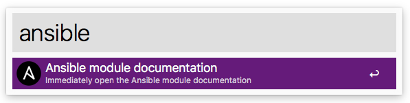

# JCID\Ansible

An Alfred workflow to easily open the Ansible module documentation page.

**Note**: You will need the Alfred [Powerpack](https://www.alfredapp.com/powerpack/) to use this workflow - which is commercial software. Check out the [Alfred app](https://www.alfredapp.com/) website.

## Usage

The keyword to trigger the search in Alfred is `ansible` by default.

### Examples

|Search|Alfred opens|
| ------------- | ------------- |
|`ansible cron`|[Ansible cron documentation](http://docs.ansible.com/ansible/latest/cron_module.html)|
|`ansible fetch`|[Ansible fetch documentation](http://docs.ansible.com/ansible/latest/fetch_module.html)|
|`ansible ini file`|[Ansible ini_file documentation](http://docs.ansible.com/ansible/latest/ini_file_module.html)|

**Note**: Spaces will be converted to underscores `_`.

## Download

Download the Alfred workflow via the URL

- http://alfred-workflow.jcid.nl/ansible

## License

This is licensed under [MIT License](LICENSE).
